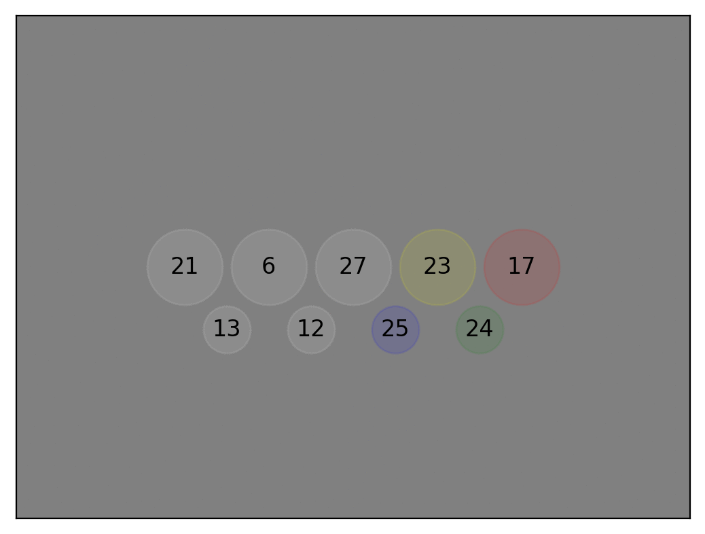

# FarmBot electronics box LED and button test firmware


```
MIX_TARGET=rpi4 mix deps.get
MIX_TARGET=rpi4 mix firmware.image test_box_btns_and_leds_rpi4.img
```

[Nerves docs](https://hexdocs.pm/nerves/getting-started.html)
